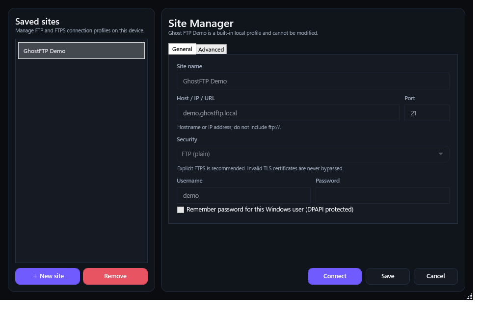

<p align="center">
  
</p>

# Ghost FTP

**Ghost FTP** (`GhostFTP`) is a privacy-first FTP/FTPS desktop client built as a professional dual-pane workstation. It combines a dense, familiar FTP workflow with Ghost FTP's modern dark/light visual system, local-only configuration, strict transport boundaries and a dependency-free C# codebase.

Ghost FTP is developed and published by **BRENDIGO LTD** (Company number **16545639**), registered office **71–75 Shelton Street, Covent Garden, London, WC2H 9JQ, United Kingdom**.

- Product website: https://ghostftp.com
- Developer / publisher website: https://brendigo.com
- Repository: https://github.com/bren-wp/Ghost
- Current source version: **0.1.0**
- Current release channel: **Beta**
- Informational version: **0.1.0-beta**
- First stable release target: **1.0.0**
- Runtime baseline: **.NET 10 / C# 14**
- Production GUI target: **Windows / WPF**
- Shared protocol core: **platform-neutral `net10.0`**
- Product identity: **Ghost FTP / GhostFTP**
- Developer / publisher / licensor: **BRENDIGO LTD**
- License: proprietary/source-available; see [LICENSE](LICENSE)

## Version line: 0.1.0 Beta → 1.0.0 stable

Ghost FTP now uses a clean public pre-1.0 version line. The current build is **0.1.0 Beta**.

The version-number reset does **not** remove or revert the work already completed in the repository. The professional workstation UI, Site Manager, Connection Log, FTP/FTPS engine, transfer queue, Setup, localization, security hardening, privacy rules, tests and authentic screenshot pipeline remain part of the codebase.

Earlier 1.x notes are preserved as historical internal-development records. New public development releases progress through `0.x.y` Beta versions until Ghost FTP is considered complete and stable. The first stable release is **1.0.0**. At that point the canonical `portable.exe` and `setup.exe` packages must carry matching stable 1.0.0 metadata.

See [docs/VERSIONING.md](docs/VERSIONING.md) for the authoritative numbering contract.

## Ghost FTP 0.1.0 Beta

Version 0.1.0 Beta carries forward the professional workstation work developed before the numbering reset, with emphasis on **clarity, information density and professional FTP ergonomics** without abandoning the Ghost FTP design language.

The main desktop window is organized into a predictable operating layout:

1. a permanent **File / View / Sites / Transfers / Tools / Help** menu bar;
2. a compact global action toolbar;
3. a **Saved Sites** navigation column;
4. a **Connection Log + Quick Connect** strip;
5. large **Local / Remote** file tables;
6. a full-width **Transfers** queue;
7. a compact local privacy/connection status bar.

The sidebar, Local/Remote split and Transfers area remain resizable, can be restored by double-clicking their splitters, and keep their geometry locally between sessions.

### Professional Site Manager

0.1.0 Beta includes the first-class Site Manager rather than forcing users through isolated one-profile-at-a-time forms.

The manager provides:

- a clear saved-site list;
- Site name;
- Host / IP / URL;
- Port;
- FTP / FTPS security mode;
- Username;
- Password;
- optional Remember password;
- default remote path;
- immediate Connect;
- local Save;
- built-in Demo protection;
- an Advanced section that explains the actual Ghost FTP passive-mode and reliability behavior.

Global timeout, retry, keepalive and concurrent-transfer settings remain centralized in Settings so site profiles do not contain misleading duplicated policy fields.

### Connection Log

The main workspace includes a bounded local connection activity log. It records useful user-visible events such as startup, profile loading, connection attempts, TLS/plain state, remote listing completion, disconnects and failures.

The log never records passwords or protected credential blobs and is never transmitted to Ghost FTP, BRENDIGO LTD or a telemetry provider.

### Better Local / Remote tables

The file workspace remains a true dual-pane browser and gives most of the window to actual files and transfer state.

- Name, Type, Size and Modified columns resize with the pane.
- Remote listings expose server-provided **Permissions** when available.
- Local/Remote paths remain directly editable.
- Local Desktop, Documents and Downloads shortcuts remain available.
- Search/filter, create folder, rename, delete, refresh and transfer actions stay close to the relevant pane.
- Multi-selection and drag-and-drop upload remain supported.

See [docs/releases/v0.1.0.md](docs/releases/v0.1.0.md) for the complete current Beta release description.

## Authentic UI screenshots

Repository UI screenshots are generated from the **real compiled Ghost FTP WPF client** rather than AI-generated mockups or external design services.

The client provides a documentation-only command:

```powershell
dotnet run --project src/GhostFTP.App/GhostFTP.App.csproj -c Release --no-build -- --capture-ui assets/readme
```

This launches the production MainWindow, opens the built-in local Demo session, renders the real Ghost FTP client and real Site Manager, and creates:

```text
assets/readme/ghostftp-client.png
assets/readme/ghostftp-site-manager.png
```

The GitHub Actions screenshot workflow rebuilds these files directly from source. Demo capture is local-only: it opens no FTP socket and makes no telemetry, analytics or external image-generation request.

When present on the current branch, the images below are exact captures of the real application code:

<p align="center">
  
</p>

<p align="center">
  
</p>

## Downloads

Every official Windows Beta or stable release is required to publish verified x64 and ARM64 assets:

- [setup.exe](https://github.com/bren-wp/Ghost/releases/latest/download/setup.exe) — Windows x64 installer
- [portable.exe](https://github.com/bren-wp/Ghost/releases/latest/download/portable.exe) — Windows x64 portable build
- [setup-arm64.exe](https://github.com/bren-wp/Ghost/releases/latest/download/setup-arm64.exe) — Windows ARM64 installer
- [portable-arm64.exe](https://github.com/bren-wp/Ghost/releases/latest/download/portable-arm64.exe) — Windows ARM64 portable build
- architecture-explicit GhostFTP copies for x64 and ARM64
- `SHA256SUMS.txt`

Canonical filenames remain stable across versions. During the `0.x.y` line they represent Beta packages and carry the current Beta file/product metadata. When Ghost FTP reaches the first stable release, these same canonical filenames must represent **1.0.0 stable** binaries.

CI and Release fail when required release executables are missing or empty.

## 29 languages

English is the primary/default language and guaranteed fallback. Ghost FTP ships selectable language support for:

English, Croatian, German, French, Spanish, Italian, Portuguese, Dutch, Polish, Czech, Slovak, Slovenian, Hungarian, Romanian, Bulgarian, Greek, Turkish, Ukrainian, Russian, Serbian, Bosnian, Swedish, Danish, Norwegian, Finnish, Japanese, Korean, Simplified Chinese and Traditional Chinese.

Application and Setup localization data is compiled into local C# code. Ghost FTP does not call an online translation service, download language packs or report the selected language.

See [docs/LOCALIZATION.md](docs/LOCALIZATION.md).

## FTP / FTPS protocol capabilities

Ghost FTP implements its FTP/FTPS engine directly on Microsoft .NET primitives and does not depend on an external FTP library.

Supported protocol behavior includes:

- FTP;
- Explicit FTPS (`AUTH TLS`);
- Implicit FTPS;
- TLS 1.2 / TLS 1.3;
- normal .NET certificate-chain and hostname validation;
- no trust-all / ignore-certificate switch;
- EPSV preference with PASV fallback;
- passive data channels bound to the authenticated control host instead of trusting a server-supplied PASV redirect host;
- UTF-8 negotiation where supported;
- MLSD with LIST fallback;
- server-confirmed `CWD` + `PWD` navigation;
- `REST` download resume with `.ghostftp.part` files where supported;
- `SIZE`-assisted download and upload length verification where available;
- upload to a temporary remote path before commit;
- rollback backup when replacing an existing remote file;
- create, rename and delete files/directories;
- recursive upload/download with traversal budgets;
- remote-root deletion protection;
- bounded reply and directory-listing parsing;
- isolated browsing/control connection and independent queued transfer sessions;
- configurable control-channel `NOOP` keepalive.

## Transfer engine

The transfer queue is an operational workstation rather than a passive progress list.

- Concurrent transfers: 1–8, default 3.
- Automatic retries: 0–5.
- Connect timeout: 3–120 seconds.
- Command timeout: 5–300 seconds.
- Transfer idle timeout: 15–3600 seconds.
- Keepalive: disabled (`0`) or 15–600 seconds.
- Transient socket/timeout and FTP 4xx conditions can retry.
- Authentication, TLS/certificate, permission and permanent FTP 5xx failures are not blindly retried.
- Each real queued transfer receives an isolated FTP/FTPS session.
- Cancellation remains scoped to the selected job.
- Queue saturation becomes a visible failed item instead of an unhandled UI exception.

Transfer rows can expose:

- item;
- direction;
- state;
- percentage;
- transferred / known total;
- speed;
- ETA;
- retry count;
- source;
- destination;
- start/finish details;
- local error detail for failed jobs;
- aggregate live throughput.

These metrics are local UI state, not product telemetry.

## File workstation

Ghost FTP provides the familiar professional dual-pane workflow while keeping its own design system:

- Saved Sites and Site Manager;
- Quick Connect;
- local Connection Log;
- resizable Saved Sites sidebar;
- resizable Local/Remote split;
- resizable Transfers area;
- persistent workspace geometry;
- Local Home, Desktop, Documents and Downloads shortcuts;
- Remote root and parent navigation;
- responsive toolbars and table columns;
- extended multi-selection;
- drag-and-drop upload from Windows;
- create folder, rename, refresh and path navigation;
- local/remote filters;
- path copying;
- Open in File Explorer for local items;
- hidden/system-item preference;
- item and selection summaries;
- retry/cancel/clear transfer controls;
- connection diagnostics from the status area.

### Keyboard shortcuts

| Shortcut | Active context | Action |
| --- | --- | --- |
| `F5` | Local / Remote | Refresh active file pane |
| `F2` | Local / Remote | Rename selected item |
| `Delete` | Local / Remote | Delete selected file/folder through normal confirmation policy |
| `Delete` | Transfers | Cancel selected active transfer |
| `Ctrl+F` | Local / Remote | Focus active pane filter |
| `Ctrl+L` | Local / Remote | Focus/select active path field |
| `Ctrl+A` | Local / Remote / Transfers | Select all |
| `Enter` | Local / Remote | Open/activate selected item |
| `Backspace` | Local / Remote | Navigate to parent directory |

Destructive shortcuts are focus-scoped so an inactive pane cannot become an accidental target.

## Privacy by design

Ghost FTP contains no:

- application telemetry;
- analytics SDK;
- advertising SDK;
- tracking SDK;
- automatic crash-report upload;
- cloud profile synchronization;
- hidden product network requests;
- automatic background product update checker.

Runtime network traffic is limited to deliberate user operations:

1. FTP/FTPS connections and operations against the selected server;
2. optional keepalive `NOOP` on that selected server session;
3. Connection Diagnostics against the selected server;
4. website links explicitly opened by the user.

Keepalive can be disabled. Demo mode and documentation screenshot capture remain completely local.

See [PRIVACY.md](PRIVACY.md).

## Security boundaries

Ghost FTP intentionally avoids “ignore errors” and “trust everything” switches.

- Explicit FTPS is the default for new profiles.
- Plain FTP requires an explicit warning.
- Password persistence is opt-in and protected with Windows DPAPI for the current user.
- FTP command arguments reject CR/LF/NUL control injection.
- Control replies and listing payloads are bounded.
- Remote paths and local extraction destinations are canonicalized.
- Recursive operations use depth and total-entry limits.
- Local recursive operations do not follow NTFS reparse points.
- Remote root deletion is blocked.
- Ambiguous `MKD 550` is verified.
- Malformed control-channel responses propagate as failures.
- Failed keepalive/diagnostics invalidate stale control state.
- Profiles/settings are size-bounded, normalized and written atomically with recovery paths.
- Queue saturation is handled as visible job state.
- Destructive keyboard actions are scoped to the focused pane.
- Installer payload and maintenance Setup copy are validated before installation/use.
- Existing installed application replacement uses atomic replacement semantics where possible.

See [SECURITY.md](SECURITY.md) and [docs/ARCHITECTURE.md](docs/ARCHITECTURE.md).

## Premium Setup

`setup.exe` uses the same Ghost FTP visual system and follows a guided Windows flow:

1. **Language** — choose Setup and initial client language.
2. **License** — review the embedded repository license and explicitly accept it.
3. **Install options** — install location and optional desktop shortcut.
4. **Ready** — review product, publisher, language and choices.
5. **Install / Update** — validate and replace the embedded application payload safely.
6. **Finish** — launch Ghost FTP or close Setup.

Uninstall uses the installed `GhostFTP-Setup.exe --uninstall`. No separate uninstaller executable, updater service, scheduled updater or telemetry component is installed.

See [docs/INSTALLATION.md](docs/INSTALLATION.md).

## Local data

Installed Ghost FTP stores settings and profiles under the current user's local application-data directory. Portable builds use a `Data` directory next to the portable executable.

Local settings can include language, appearance, last directory, delete confirmation, hidden-file visibility, retry/concurrency/timeouts, keepalive and workspace geometry.

Saved passwords are optional. When enabled, passwords are protected through Windows DPAPI in current-user scope. Ghost FTP does not provide a cloud credential vault or profile synchronization service.

## Zero third-party runtime package dependencies

Shipping source contains **zero NuGet `PackageReference` entries**.

The Windows client uses only:

- C#;
- Microsoft .NET base class libraries;
- Microsoft WPF included in .NET Desktop;
- Windows APIs already present for DPAPI, DWM/Mica, shell shortcuts and Installed Apps registration.

Official Windows releases are self-contained.

## Platform support

- **Windows x64 / ARM64:** production desktop GUI, portable build and Setup.
- **Linux:** `GhostFTP.Core` targets platform-neutral `net10.0` and is reusable by a future Linux renderer. A production Linux GUI is **not** claimed while the application presentation layer remains WPF and the project retains a zero-third-party-package policy.
- **Android / iOS:** not shipping and outside the current desktop product scope.

Ghost FTP never labels a Windows binary as Linux-compatible just to satisfy a platform badge. See [docs/PLATFORM-SUPPORT.md](docs/PLATFORM-SUPPORT.md) for the parity contract a real Linux renderer must satisfy.

## Build and validate

Requirements for the production Windows GUI:

- Windows 10 version 2004 or newer; Windows 11 recommended;
- .NET SDK 10.0.x for source builds.

```powershell
dotnet restore GhostFTP.sln
dotnet build GhostFTP.sln -c Release
./audit-source.ps1
dotnet run --project tests/GhostFTP.SelfTest/GhostFTP.SelfTest.csproj -c Release --no-build
dotnet run --project tests/GhostFTP.QueueSelfTest/GhostFTP.QueueSelfTest.csproj -c Release --no-build
dotnet run --project tests/GhostFTP.UiSmoke/GhostFTP.UiSmoke.csproj -c Release --no-build
```

Create verified release packages:

```powershell
./build-release.ps1
```

Expected release output:

```text
setup.exe
portable.exe
setup-arm64.exe
portable-arm64.exe
GhostFTP-Setup-win-x64.exe
GhostFTP-Portable-win-x64.exe
GhostFTP-Setup-win-arm64.exe
GhostFTP-Portable-win-arm64.exe
SHA256SUMS.txt
```

## Quality gates

Every release candidate is required to pass:

1. .NET restore;
2. warning-as-error Release build;
3. dependency/version/channel/privacy/product/publisher/platform source audit;
4. Core security/correctness self-tests;
5. parallel queue concurrency/session-isolation tests;
6. real Windows/WPF editable-input tests;
7. application localization checks;
8. Setup localization and live language-switch checks;
9. authentic MainWindow + Site Manager screenshot capture from the compiled WPF client;
10. Ghost FTP / BRENDIGO LTD identity checks;
11. Windows x64 and ARM64 self-contained packaging for official release runs;
12. canonical setup/portable executable verification;
13. SHA-256 release manifest generation;
14. verified artifact upload.

A Beta build remains Beta even when all gates pass; stable status begins only with the explicit 1.0.0 stable version transition defined in `docs/VERSIONING.md`.

## Documentation

- [CHANGELOG.md](CHANGELOG.md) — current Beta history plus preserved internal development history.
- [docs/VERSIONING.md](docs/VERSIONING.md) — 0.x Beta → 1.0.0 stable numbering contract.
- [docs/releases/v0.1.0.md](docs/releases/v0.1.0.md) — current detailed Beta release notes.
- [docs/releases/](docs/releases/) — current and preserved historical release notes.
- [docs/INSTALLATION.md](docs/INSTALLATION.md) — install/update/uninstall behavior.
- [docs/LOCALIZATION.md](docs/LOCALIZATION.md) — localization architecture and languages.
- [docs/PLATFORM-SUPPORT.md](docs/PLATFORM-SUPPORT.md) — exact Windows/Linux/mobile support contract.
- [docs/RELEASE-POLICY.md](docs/RELEASE-POLICY.md) — release requirements.
- [docs/ARCHITECTURE.md](docs/ARCHITECTURE.md) — code/runtime architecture.
- [docs/UI-UX.md](docs/UI-UX.md) — desktop interaction and visual rules.
- [SECURITY.md](SECURITY.md) — security boundaries and reporting.
- [PRIVACY.md](PRIVACY.md) — runtime privacy and network behavior.
- [LICENSE](LICENSE) — BRENDIGO LTD Ghost FTP license.

## Preserved historical development records

The repository contains detailed 1.x release-note files and changelog entries created during the earlier internal development numbering. They are retained deliberately for engineering traceability and to ensure the work already completed is not hidden or discarded.

Those records do **not** override the current public version. The active public line begins with **0.1.0 Beta**.

## Project structure

```text
assets/
  brand/               official Ghost FTP vector branding
  readme/              real UI captures + repository artwork
src/
  GhostFTP.Core/       platform-neutral FTP/FTPS engine, parsers, Demo session, transfer queue
  GhostFTP.Design/     shared Windows design, identity and localization
  GhostFTP.App/        Windows desktop application and real UI capture path
  GhostFTP.Setup/      guided Windows install/update/uninstall wizard
tests/
  GhostFTP.SelfTest/   Core security and correctness tests
  GhostFTP.QueueSelfTest/ bounded parallel queue/session-isolation tests
  GhostFTP.UiSmoke/    live Windows/WPF input, localization and Setup smoke tests
docs/
  VERSIONING.md        public Beta/stable versioning contract
  releases/            current and preserved historical release notes
```

Ghost FTP is developed and published by **BRENDIGO LTD** — https://brendigo.com. Copyright © 2026 BRENDIGO LTD. All rights reserved. See [NOTICE.md](NOTICE.md).
