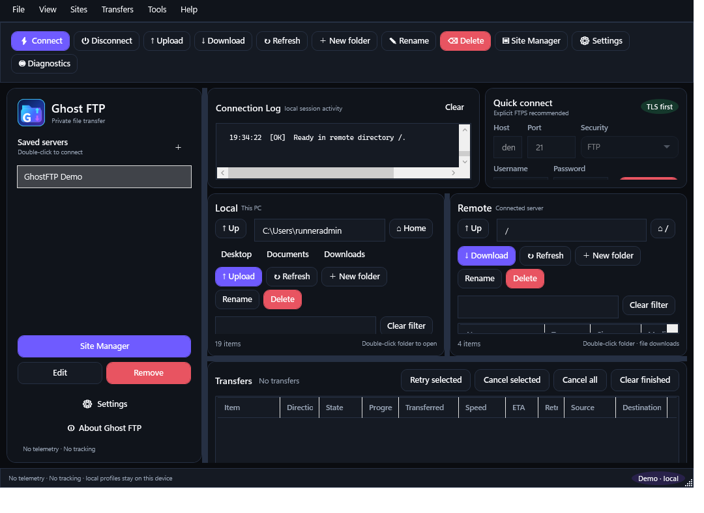

<p align="center">
  
</p>

<p align="center"><strong>Authentic application capture generated from the compiled Ghost FTP desktop client — not a mockup, illustration or generated UI.</strong></p>

# Ghost FTP

**Ghost FTP** (`GhostFTP`) is a privacy-first native FTP/FTPS desktop workstation for **Windows and Linux**. It combines a modern dual-pane workflow, bounded parallel transfers, local-only profiles, strict TLS behavior, safe resumable downloads, a resizable professional UI and a dependency-minimal C#/.NET codebase.

Ghost FTP is developed and published by **BRENDIGO LTD** (Company number **16545639**), 71–75 Shelton Street, Covent Garden, London, WC2H 9JQ, United Kingdom.

- Product: https://ghostftp.com
- Publisher: https://brendigo.com
- GitHub Releases: https://github.com/bren-wp/Ghost/releases
- Current source version: **0.1.6**
- Current release channel: **Beta**
- Informational version: **0.1.6-beta**
- First stable target: **1.0.0**
- Runtime baseline: **.NET 10 / C# 14**
- Detailed release notes: [`docs/releases/v0.1.6.md`](docs/releases/v0.1.6.md)

## What Ghost FTP is built for

Ghost FTP is a real desktop file-transfer client, not a web wrapper. It keeps the familiar dual-pane workflow expected from professional FTP clients while using a cleaner contemporary interface and explicit privacy/security boundaries.

The workstation provides saved servers, session-only Quick Connect, Local and Remote file panes, upload/download queues, retry/cancellation/history cleanup, queue dispatch pause/resume, connection logs, local diagnostics, Site Manager, configurable retries/concurrency/timeouts/keepalive, 29 local languages, and native Windows/Linux renderers sharing the same protocol and transfer core.

## 0.1.6 Beta highlights

### Safe resumable downloads

Interrupted downloads are no longer resumed from a `.ghostftp.part` file based only on local length. When the server exposes both `SIZE` and `MDTM`, Ghost FTP stores a bounded local identity sidecar and permits REST resume only when host, port, security mode, remote path, size and modification timestamp still match.

A pre-0.1.6, corrupt, oversized or stale partial is restarted from zero rather than appended blindly. If stale/untrusted staged bytes cannot be removed, Ghost FTP fails closed before REST/RETR instead of falling back to length-only reuse. If the server cannot provide a trustworthy `SIZE` + `MDTM` identity, Ghost FTP still performs a fresh download but does not retain an interrupted unverified partial as safely resumable state.

### Staged commit and remote revision protection

For downloads with a verifiable remote identity, downloaded bytes stay in `.ghostftp.part` while Ghost FTP rechecks `SIZE` and `MDTM` after transfer. Only a matching revision is promoted to the final destination.

If the server-side object changes while bytes are in flight, the staged result is discarded and the transfer reports an integrity error. Any pre-existing destination remains byte-for-byte untouched because it is not replaced until validation succeeds. The same per-file integrity path is used by recursive directory downloads.

### Dedicated deterministic testing

`GhostFTP.ResumeSelfTest` is an isolated package-free loopback suite. It verifies an exact valid REST offset, stale-identity restart from byte zero, byte-for-byte output, detection of a same-size remote revision change, preservation of an existing destination on rejected mutation, and fail-closed stale-partial cleanup before REST/RETR.

Both Windows and Linux CI run this gate independently from the broader protocol hardening suite, and the publication workflow runs it again on both shipping platforms before release assets can be published.

### 0.1.5 quality work retained

The 0.1.5 listing/parser bounds, non-backtracking LIST parsing, pooled/cleared transfer buffers, lower-overhead progress delivery, coalesced pane refresh, persisted workstation dimensions and visible queue pause/resume action remain part of the 0.1.6 baseline.

## Supported protocols

Ghost FTP currently implements:

- FTP;
- Explicit FTPS (`AUTH TLS`);
- Implicit FTPS.

Explicit FTPS is recommended where supported. Ghost FTP does **not** label SFTP as FTP and does not claim SSH/SFTP support in this release line.

## Security model

The shipping client preserves these boundaries:

- fail-closed transport-mode validation;
- TLS 1.2/1.3 certificate and hostname validation;
- no silent FTPS-to-FTP downgrade;
- `PBSZ 0` / `PROT P` encrypted-data protection for FTPS;
- required binary `TYPE I` transfer mode;
- passive data connections tied to the authenticated control host;
- strict EPSV/PASV tuple and port parsing;
- CR/LF/NUL command-injection guards;
- bounded control replies, directory listings, traversal and transfer-queue resources;
- non-backtracking LIST parsing;
- local path containment checks;
- deletion confirmation and root/path protections;
- bounded retry and concurrency behavior;
- isolated transfer sessions;
- cancellation-safe coordinated shutdown;
- clearing of pooled buffers that may contain transferred file data;
- bounded local resume metadata and fail-closed remote revision matching before REST resume;
- staged download commit that preserves an existing destination until post-transfer validation succeeds.

Read [`SECURITY.md`](SECURITY.md) for the complete hardening model.

## Download resume integrity

A resumable partial uses:

```text
<destination>.ghostftp.part
<destination>.ghostftp.part.meta
```

The sidecar is local-only, capped at 16 KiB and contains no password, username, token or transferred file bytes. It identifies the selected endpoint and remote object revision.

Resume remains an optimization: when the server cannot provide enough identity information, correctness takes priority and Ghost FTP restarts rather than trusting stale bytes. Untrusted staged state must be removed successfully before a fresh transfer can continue. A verifiable download remains staged until the remote revision is checked again, so integrity failure cannot overwrite an existing destination.

See [`docs/releases/v0.1.6.md`](docs/releases/v0.1.6.md).

## Privacy

Ghost FTP is designed to run **without application telemetry**. The application contains no analytics SDK, advertising SDK, usage telemetry, user fingerprinting, hidden crash uploader, cloud profile synchronization, hidden product-account requirement or automatic background update checker.

Quick Connect credentials are session-only unless the user explicitly saves a profile. Saved-password protection is opt-in. Windows uses the current-user DPAPI boundary; Linux uses AES-256-GCM with local user-private key material. Resume metadata stays local and contains no credential material.

Read [`PRIVACY.md`](PRIVACY.md).

## Transfer queue semantics

The shared bounded queue supports configurable concurrency, bounded transient retries, cancellation isolation, queued/running/retrying/completed/failed/cancelled state, progress/speed/ETA reporting, dispatch pause/resume and selective history cleanup.

**Pause queue** pauses dispatch only. Transfers already running continue. Ghost FTP does not claim arbitrary active FTP byte streams can be frozen and resumed when the server has not negotiated such semantics.

## Windows

The Windows renderer is native WPF with per-monitor DPI awareness, long-path awareness and resizable/persisted workstation panes.

### Windows release files

Canonical and architecture-specific release files include:

- `setup.exe`
- `portable.exe`
- `setup-arm64.exe`
- `portable-arm64.exe`
- `GhostFTP-Setup-win-x64.exe`
- `GhostFTP-Portable-win-x64.exe`
- `GhostFTP-Setup-win-arm64.exe`
- `GhostFTP-Portable-win-arm64.exe`
- `SHA256SUMS.txt`
- `SIGNING.txt`

The same Setup executable is the installed maintenance/uninstall entry. Ghost FTP intentionally does not generate a separate `uninstall.exe`.

## Linux

The Linux renderer is a native C# X11/XWayland desktop client using the system `libX11.so.6` ABI. It shares `GhostFTP.Core` and `GhostFTP.Design` with Windows rather than implementing a separate FTP engine.

### Linux release files

Canonical Linux assets include:

- `GhostFTP-linux-x64`
- `GhostFTP-linux-arm64`
- corresponding `.tar.gz` archives;
- versioned archives;
- `SHA256SUMS-linux.txt`;
- `BUILD-INFO.txt`.

Linux consumes the same FTP/FTPS parser, transfer queue, staged download-resume integrity logic, bounded resource model, localization and local persistence primitives.

## Platform scope

Shipping desktop scope is intentionally limited to Windows x64/ARM64 and Linux x64/ARM64. Android, iOS, macOS/MacCatalyst and web application targets are not part of this repository's shipping product scope.

## Localization

Ghost FTP provides **29 selectable languages** from local application resources. **English (`en`) is the primary language, default language and final fallback.** No online translation API is used by the client or Setup.

See [`docs/LOCALIZATION.md`](docs/LOCALIZATION.md).

## Demo mode

The built-in Ghost FTP Demo profile is completely local. It opens no external FTP connection and is used by the regression suite to exercise listing, upload/download, rename, recursive directory behavior, cleanup and disconnect lifecycle.

## Real-server smoke testing

A separate non-destructive live-server harness can validate connect/PWD/LIST/NOOP/disconnect against explicitly configured credentials without server writes. Credential values are supplied through protected CI secrets and are redacted from output.

See [`docs/LIVE-SMOKE-TEST.md`](docs/LIVE-SMOKE-TEST.md).

## Build from source

Requirements are .NET 10 SDK, Windows for the real WPF renderer/Setup build, and Linux with X11/XWayland runtime libraries for the native Linux renderer.

```text
dotnet restore GhostFTP.sln
dotnet build GhostFTP.sln -c Release
```

The isolated safe-resume regression project can also be run directly:

```text
dotnet run --project tests/GhostFTP.ResumeSelfTest/GhostFTP.ResumeSelfTest.csproj -c Release
```

Official releases use repository CI/release gates rather than relying only on a local compile.

## Dependency policy

Shipping and regression-test projects intentionally contain **zero third-party NuGet `PackageReference` dependencies**. Platform APIs are accessed through the .NET runtime/BCL, WPF on Windows, audited native Windows calls where required, and the audited X11 ABI layer on Linux.

Repository audits reject known telemetry/tracking SDK references, mobile-scope drift and private signing-key material.

## CI and release gates

A Ghost FTP Beta source is not release-ready until the relevant Windows/Linux pipeline passes:

- restore/build with warnings treated as errors;
- source/dependency/platform/privacy audit;
- final security hardening audit;
- Core self-test;
- complete local Demo workflow self-test;
- parallel transfer queue self-test;
- protocol/parser/shutdown hardening self-test;
- safe download resume-integrity self-test on Windows and Linux;
- Windows WPF editable-input/localization smoke test;
- Linux X11/XWayland runtime smoke test;
- authentic Windows UI capture;
- Windows and Linux packaging;
- required artifact verification;
- SHA-256 generation/verification.

## Documentation

- [`docs/releases/v0.1.6.md`](docs/releases/v0.1.6.md) — detailed 0.1.6 Beta release notes
- [`CHANGELOG.md`](CHANGELOG.md) — cumulative public version history
- [`docs/HISTORICAL-CHANGELOG.md`](docs/HISTORICAL-CHANGELOG.md) — preserved pre-reset engineering history
- [`docs/ARCHITECTURE.md`](docs/ARCHITECTURE.md) — architecture and trust boundaries
- [`docs/UI-UX.md`](docs/UI-UX.md) — UI/UX contract
- [`docs/UI-PARITY.md`](docs/UI-PARITY.md) — Windows/Linux parity contract
- [`docs/INSTALLATION.md`](docs/INSTALLATION.md) — install/update/uninstall model
- [`docs/LOCALIZATION.md`](docs/LOCALIZATION.md) — local language architecture
- [`docs/PLATFORM-SUPPORT.md`](docs/PLATFORM-SUPPORT.md) — shipping platform scope
- [`docs/RELEASE-POLICY.md`](docs/RELEASE-POLICY.md) — release requirements
- [`docs/LIVE-SMOKE-TEST.md`](docs/LIVE-SMOKE-TEST.md) — non-destructive real-server verification
- [`SECURITY.md`](SECURITY.md) — security model
- [`PRIVACY.md`](PRIVACY.md) — privacy model

## Versioning

The public source version is controlled by root `VERSION` and `RELEASE_CHANNEL`. All 0.x releases remain Beta. Version **1.0.0** is reserved for the first stable public release. Historical engineering documents are preserved for traceability and do not override the current public version line.

## License

The repository is source-available/proprietary under [`LICENSE`](LICENSE). See [`NOTICE.md`](NOTICE.md) for publisher and legal information.
