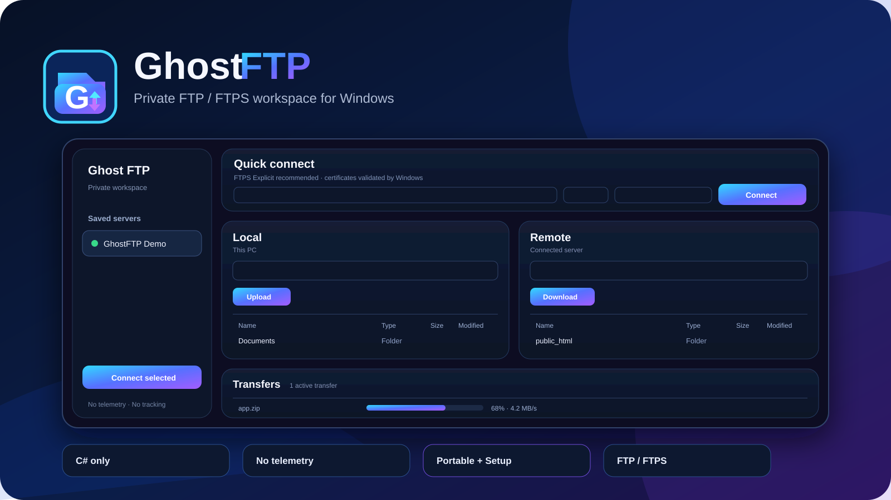

<p align="center">
  
</p>

# Ghost FTP

**Ghost FTP** (`GhostFTP`) is a privacy-first FTP/FTPS desktop client with a modern dual-pane workspace, local-only configuration, a dependency-free C# codebase and a release pipeline that publishes verified Windows installer and portable editions.

Ghost FTP is developed and published by **BRENDIGO LTD** (Company number **16545639**), registered office **71–75 Shelton Street, Covent Garden, London, WC2H 9JQ, United Kingdom**.

- Product website: https://ghostftp.com
- Developer / publisher website: https://brendigo.com
- Repository: https://github.com/bren-wp/Ghost
- Current source version: **1.5.0**
- Runtime baseline: **.NET 10 / C# 14**
- Production GUI target: **Windows / WPF**
- Shared protocol core: **platform-neutral `net10.0`**
- Product identity: **Ghost FTP / GhostFTP**
- Developer / publisher / licensor: **BRENDIGO LTD**
- License: proprietary/source-available; see [LICENSE](LICENSE)

## Downloads

Every official Windows release is required to publish these verified assets:

- [setup.exe](https://github.com/bren-wp/Ghost/releases/latest/download/setup.exe) — Windows x64 installer
- [portable.exe](https://github.com/bren-wp/Ghost/releases/latest/download/portable.exe) — Windows x64 portable build
- [setup-arm64.exe](https://github.com/bren-wp/Ghost/releases/latest/download/setup-arm64.exe) — Windows ARM64 installer
- [portable-arm64.exe](https://github.com/bren-wp/Ghost/releases/latest/download/portable-arm64.exe) — Windows ARM64 portable build
- architecture-explicit GhostFTP copies for x64 and ARM64
- `SHA256SUMS.txt`

CI and Release fail if any required executable is missing or empty.

## What changed in 1.5.0

Ghost FTP 1.5.0 focuses on professional desktop ergonomics, transfer throughput and explicit platform/release discipline.

- Added real resizable splitters for the Saved Servers sidebar, Local/Remote file panes and transfer queue.
- Added double-click splitter reset behavior so users can recover the default workspace quickly.
- Explicitly enabled resize-with-grip behavior and reduced the safe minimum window size.
- Fixed a real responsive-layout bug: dynamic GridView column resizing existed but was never wired into the main-window lifecycle.
- File and queue columns now recalculate when the window or underlying list changes size.
- Reworked the transfer queue from one worker to a bounded parallel worker pool.
- Up to three transfers run concurrently by default, while the engine keeps an internal hard cap of eight.
- Real FTP/FTPS jobs continue to use isolated transfer sessions so one failure cannot desynchronize browsing or another transfer.
- Queue shutdown now awaits every worker before releasing cancellation resources.
- Added an explicit platform-support contract: Windows remains the production GUI, `GhostFTP.Core` remains reusable `net10.0`, Android/iOS are not shipping, and Linux GUI support is not falsely claimed while the project remains WPF + zero-third-party-package.
- Version metadata and detailed release documentation are synchronized to 1.5.0.

See [docs/releases/v1.5.0.md](docs/releases/v1.5.0.md) and [docs/PLATFORM-SUPPORT.md](docs/PLATFORM-SUPPORT.md).

## 1.4.2 stability baseline

Ghost FTP 1.4.2 fixed the Setup crash that could occur when switching languages while the WPF ComboBox still owned controls from the previous logical tree.

- Reusable wizard controls are detached before rebuilding.
- Language-driven rebuilds are deferred until the input event unwinds.
- Repeated rebuild requests are coalesced.
- The real Setup window is exercised by a live WPF language-switch smoke test.

See [docs/releases/v1.4.2.md](docs/releases/v1.4.2.md).

## 29 languages

English remains the primary language and the guaranteed fallback. Ghost FTP ships selectable language support for:

English, Croatian, German, French, Spanish, Italian, Portuguese, Dutch, Polish, Czech, Slovak, Slovenian, Hungarian, Romanian, Bulgarian, Greek, Turkish, Ukrainian, Russian, Serbian, Bosnian, Swedish, Danish, Norwegian, Finnish, Japanese, Korean, Simplified Chinese and Traditional Chinese.

The desktop app and Setup share one local C# localization system. No translation service, cloud lookup or network request is used. CI checks the core application catalog and Setup wizard catalog for all 29 languages.

## Setup wizard

`setup.exe` uses a guided Windows 11-style flow:

1. **Language** — choose the Setup language and initial Ghost FTP client language.
2. **License** — review the embedded repository license and explicitly accept it before continuing.
3. **Install options** — review install location and optional desktop shortcut.
4. **Ready** — confirm product, publisher, language and installation choices.
5. **Install / Update** — validate and replace the embedded application payload safely.
6. **Finish** — launch Ghost FTP or close Setup.

Uninstall uses the same installed `GhostFTP-Setup.exe --uninstall` maintenance executable. Ghost FTP does **not** generate a separate uninstaller executable. Windows Installed Apps points to that same Setup binary.

See [docs/INSTALLATION.md](docs/INSTALLATION.md).

## FTP reliability and integrity

- configurable connect, command and transfer-idle timeouts;
- configurable automatic transfer retry count from 0–5;
- automatic retry is limited to transient network / FTP 4xx failures;
- authentication, certificate, permission and permanent FTP errors are not retried blindly;
- bounded parallel transfer workers with isolated real FTP/FTPS sessions;
- transfer queue exposes retry count and Retrying state;
- cancelling one job during retry backoff cannot terminate the queue;
- remote navigation synchronizes UI path state through server `CWD` + `PWD`;
- connection diagnostics perform local `NOOP`, `SYST`, `PWD` and capability checks against the connected server;
- downloads verify final partial-file length against server `SIZE` when available before promotion to the destination;
- uploads verify temporary/final remote size through `SIZE` when available before/after commit;
- failed upload replacement keeps rollback behavior for an existing destination.

## Core FTP / FTPS capabilities

- FTP.
- Explicit FTPS (`AUTH TLS`).
- Implicit FTPS.
- TLS 1.2 / TLS 1.3.
- Standard Windows/.NET certificate-chain and hostname validation in the production Windows client.
- No certificate-validation bypass setting.
- EPSV with PASV fallback.
- Passive data channels use the authenticated control host rather than trusting a server-supplied PASV host redirect.
- UTF-8 negotiation where supported.
- MLSD parsing with LIST fallback.
- Download resume through `REST` and `.ghostftp.part` files when supported.
- Upload through temporary remote files before final rename.
- Rollback backup when replacing an existing remote file.
- Create, rename, delete and recursively manage remote directories.
- Directory listing and recursive traversal resource limits.
- Separate control connection for browsing and independent transfer connections for queue jobs.

## File workspace

Ghost FTP provides a dual-pane Local / Remote workflow with:

- saved server profiles and Quick Connect;
- labeled Host, Port, Security, Username and Password inputs;
- native WPF TextBox/PasswordBox editing for reliable focus, caret, selection, paste and keyboard/IME behavior;
- Local Home, Desktop, Documents and Downloads shortcuts;
- Remote root and parent navigation;
- resizable Saved Servers, Local/Remote and Transfers regions;
- responsive wrapping toolbars and dynamically sized file/queue columns;
- multi-selection upload/download/delete workflows;
- drag-and-drop upload;
- create folder, rename, refresh and path navigation;
- local filtering and remote filtering;
- copy local/remote paths;
- Open in File Explorer for local items;
- hidden/system item preference;
- item and selection summaries;
- parallel transfer queue with progress, speed, retry count, Retry selected, Cancel selected, Cancel all and Clear finished;
- connection diagnostics from the connection status area;
- keyboard shortcuts including `F5`, `F2`, `Delete`, `Ctrl+F` and `Ctrl+L`.

## Privacy by design

Ghost FTP contains no application telemetry, analytics SDK, advertising SDK, tracking SDK, crash-report upload, automatic update checker or background product network service.

Application network traffic is created only when the user explicitly:

1. connects to an FTP/FTPS server;
2. performs FTP/FTPS operations; or
3. opens a Ghost FTP or BRENDIGO LTD website link.

Demo mode is completely local and opens no network connection. Connection diagnostics communicate only with the FTP/FTPS server that the user is already connected to and do not upload results to Ghost FTP or BRENDIGO LTD.

See [PRIVACY.md](PRIVACY.md).

## Zero third-party runtime dependencies

The source tree contains **zero NuGet `PackageReference` entries**. Shipping Windows code uses only:

- C#;
- Microsoft .NET base class libraries;
- Microsoft WPF included in .NET Desktop;
- Windows APIs already present in Windows for DPAPI, DWM/Mica, shell shortcuts and uninstall registration.

Windows releases are self-contained. End users do not need to install .NET separately.

## Platform support

- **Windows x64 / ARM64:** production desktop GUI and Setup.
- **Linux:** the protocol engine is reusable because `GhostFTP.Core` targets `net10.0`; a production Linux GUI is not yet claimed because WPF is Windows-only and this repository currently forbids third-party package dependencies.
- **Android / iOS:** not shipping and not part of the current desktop product scope.

Ghost FTP does not call a Windows binary “Linux-compatible” merely to satisfy a platform label. See [docs/PLATFORM-SUPPORT.md](docs/PLATFORM-SUPPORT.md) for the parity requirements a real Linux desktop renderer must meet.

## Security boundaries

Ghost FTP intentionally avoids “ignore errors” or “trust everything” switches:

- Explicit FTPS is the default for new profiles.
- Plain FTP requires an explicit warning before connection.
- Password persistence is opt-in and protected with Windows DPAPI for the current user.
- FTP command arguments reject CR/LF/NUL control injection.
- Control replies and listing payloads are bounded.
- Remote paths and local extraction destinations are canonicalized.
- Recursive operations use depth and total-entry budgets.
- Local recursive upload does not follow NTFS reparse points.
- Remote root deletion is blocked.
- Ambiguous `MKD 550` responses are verified before being treated as “already exists”.
- Malformed control-channel responses propagate as real failures.
- Profiles/settings are size-bounded, normalized and written atomically with recovery paths.
- Queue saturation creates a failed transfer item instead of an unhandled UI exception.
- Installer application payload and maintenance Setup copy are validated before installation.
- Existing installed application replacement uses atomic replacement semantics when possible.

See [SECURITY.md](SECURITY.md) and [docs/ARCHITECTURE.md](docs/ARCHITECTURE.md).

## Local data

Installed Ghost FTP stores settings and profiles under the current user's local application-data directory. Portable builds use a `Data` directory next to the executable when running as a portable build.

Saved passwords are optional. When enabled they are encrypted through Windows DPAPI and scoped to the current Windows user.

## Build and validate

Requirements for the production Windows GUI:

- Windows 10 version 2004 or newer; Windows 11 recommended;
- .NET SDK 10.0.x for source builds.

```powershell
dotnet restore GhostFTP.sln
dotnet build GhostFTP.sln -c Release
./audit-source.ps1
dotnet run --project tests/GhostFTP.SelfTest/GhostFTP.SelfTest.csproj -c Release --no-build
dotnet run --project tests/GhostFTP.UiSmoke/GhostFTP.UiSmoke.csproj -c Release --no-build
```

Create all release packages:

```powershell
./build-release.ps1
```

Release output:

```text
setup.exe
portable.exe
setup-arm64.exe
portable-arm64.exe
GhostFTP-Setup-win-x64.exe
GhostFTP-Portable-win-x64.exe
GhostFTP-Setup-win-arm64.exe
GhostFTP-Portable-win-arm64.exe
SHA256SUMS.txt
```

## Quality gates

Every `main` update is required to pass:

1. .NET restore;
2. Release build with warnings treated as errors;
3. dependency/version/privacy/product/publisher source audit;
4. Core security/correctness self-tests;
5. real Windows/WPF editable-input smoke tests;
6. application localization coverage checks;
7. Setup localization coverage checks;
8. Ghost FTP / BRENDIGO LTD website identity checks;
9. x64 and ARM64 self-contained packaging;
10. canonical `setup.exe` and `portable.exe` verification;
11. artifact upload.

The Release workflow repeats these checks before a GitHub Release can be published.

## Documentation

- [CHANGELOG.md](CHANGELOG.md) — detailed version history.
- [docs/releases/](docs/releases/) — version-specific detailed release notes.
- [docs/INSTALLATION.md](docs/INSTALLATION.md) — install, update and uninstall behavior.
- [docs/LOCALIZATION.md](docs/LOCALIZATION.md) — languages and translation architecture.
- [docs/PLATFORM-SUPPORT.md](docs/PLATFORM-SUPPORT.md) — exact Windows/Linux/mobile support contract.
- [docs/RELEASE-POLICY.md](docs/RELEASE-POLICY.md) — release requirements and quality gates.
- [docs/ARCHITECTURE.md](docs/ARCHITECTURE.md) — project and runtime architecture.
- [docs/UI-UX.md](docs/UI-UX.md) — shared Windows 11 design rules.
- [SECURITY.md](SECURITY.md) — security model and reporting.
- [PRIVACY.md](PRIVACY.md) — privacy and network behavior.
- [LICENSE](LICENSE) — BRENDIGO LTD Ghost FTP license.

## Project structure

```text
assets/
  brand/               official Ghost FTP vector branding
  readme/              repository artwork
src/
  GhostFTP.Core/       platform-neutral FTP/FTPS engine, parsers, demo session, transfer queue
  GhostFTP.Design/     shared Windows design, product identity and localization
  GhostFTP.App/        Windows desktop application, C# programmatic WPF UI
  GhostFTP.Setup/      guided Windows install/update/uninstall wizard
tests/
  GhostFTP.SelfTest/   Core security and correctness tests
  GhostFTP.UiSmoke/    real Windows/WPF input and localization smoke tests
docs/
  releases/            detailed notes used by GitHub Releases
```

Ghost FTP is developed and published by **BRENDIGO LTD** — https://brendigo.com. Copyright © 2026 BRENDIGO LTD. All rights reserved. See [NOTICE.md](NOTICE.md).
